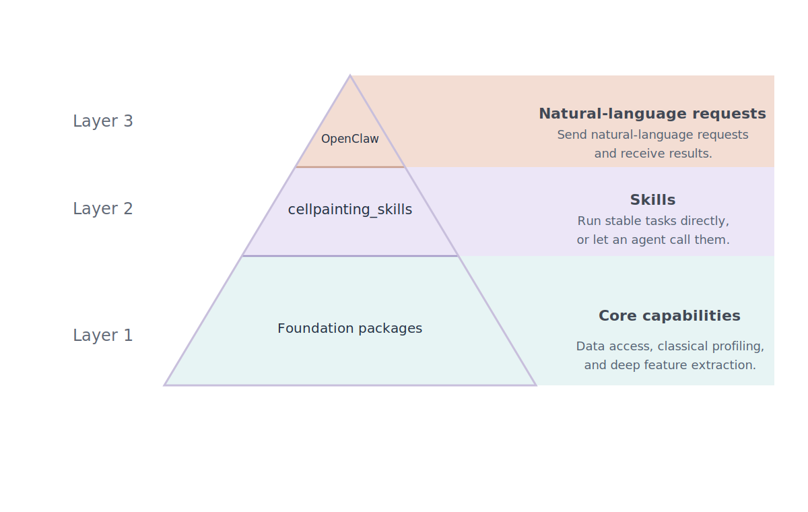

# CellPainting-Claw

CellPainting-Claw was built to make Cell Painting work less fragmented and more usable through agents. Instead of asking users to stitch together data-access utilities, CellProfiler steps, pycytominer processing, DeepProfiler preparation, and agent glue by hand, the project exposes one documented skill catalog for both direct use and agent-mediated use.

The same documented skills can be used in two ways:

- **run the skills directly**
- **run the same skills through an agent**

## Project Layout

CellPainting-Claw is organized as a simple three-part structure:



People can use the same skills in two ways:

- directly, through `cellpainting_skills`
- through an agent, through `OpenClaw`

Both paths rely on the same foundation packages underneath. The lower-level `cellpainting_claw` package remains available for advanced direct toolkit use, but it is not the main starting point for most users.

## Core Packages

The foundation packages are easiest to understand in workflow order.

| Capability | Packages | Main capability |
| --- | --- | --- |
| Data access | `boto3`, `quilt3`, `cpgdata` | dataset discovery and download |
| Measurement extraction | `CellProfiler` | profiling tables, segmentation masks, labels, outlines, and crop-ready object data |
| Classical profile generation | `pycytominer` | aggregation, annotation, normalization, and feature selection |
| Deep feature extraction | `DeepProfiler` | learned single-cell feature extraction |

## Main Entry Paths

For most users, CellPainting-Claw should be understood through **two main usage paths**.

| Purpose | Start with | Outcome |
| --- | --- | --- |
| run documented tasks yourself from Python or from the command line | `cellpainting_skills` | you call the documented skills directly, such as segmentation, pycytominer processing, or DeepProfiler tasks |
| tell an agent in plain language what you want done | `OpenClaw` | the agent maps your request onto the same documented skills and runs them through the same toolkit |

## Public Skill Catalog

Skills are the **core public task interface** of the project.

### Data Access

| Skill | Main result |
| --- | --- |
| `data-inspect-availability` | inspect configured sources and write an availability summary |
| `data-plan-download` | resolve a download request into a saved download plan |
| `data-download` | download one dataset slice into a local cache |

### Profiling

| Skill | Main result |
| --- | --- |
| `cp-extract-measurements` | write CellProfiler measurement tables |
| `cp-build-single-cell-table` | merge CellProfiler tables into one single-cell measurements table |
| `cyto-aggregate-profiles` | write the aggregated classical profile table |
| `cyto-annotate-profiles` | attach metadata to aggregated profiles |
| `cyto-normalize-profiles` | write the normalized classical profile table |
| `cyto-select-profile-features` | write the feature-selected classical profile table |
| `cyto-summarize-classical-profiles` | turn classical profile outputs into readable summaries and PCA views |

### Segmentation

| Skill | Main result |
| --- | --- |
| `cp-prepare-segmentation-inputs` | prepare the load-data table used by segmentation |
| `cp-extract-segmentation-artifacts` | write masks, labels, outlines, and segmentation tables |
| `cp-generate-segmentation-previews` | write preview PNGs for quick review |
| `crop-export-single-cell-crops` | export masked or unmasked single-cell crop stacks |

### Deep Features

| Skill | Main result |
| --- | --- |
| `dp-export-deep-feature-inputs` | build DeepProfiler-ready metadata and location files |
| `dp-build-deep-feature-project` | prepare a runnable DeepProfiler project directory |
| `dp-run-deep-feature-model` | run the DeepProfiler model and write raw feature files |
| `dp-collect-deep-features` | collect raw feature files into tabular outputs |
| `dp-summarize-deep-features` | turn DeepProfiler tables into readable summaries and PCA views |

## Start Here

Start with these pages:

- [Introduction](introduction/index.md)
- [Quick Start](quick_start/index.md)
- [Demo](demo/index.md)
- [Skills](skills/index.md)
- [CLI](cli/index.md)
- [OpenClaw](openclaw/index.md)

```{toctree}
:maxdepth: 2
:caption: Introduction
:hidden:

introduction/index
```

```{toctree}
:maxdepth: 2
:caption: Installation
:hidden:

installation/index
```

```{toctree}
:maxdepth: 2
:caption: Quick Start
:hidden:

quick_start/index
```

```{toctree}
:maxdepth: 2
:caption: Demo
:hidden:

demo/index
```

```{toctree}
:maxdepth: 2
:caption: Skills
:hidden:

skills/index
```

```{toctree}
:maxdepth: 2
:caption: CLI
:hidden:

cli/index
```

```{toctree}
:maxdepth: 2
:caption: OpenClaw
:hidden:

openclaw/index
```
