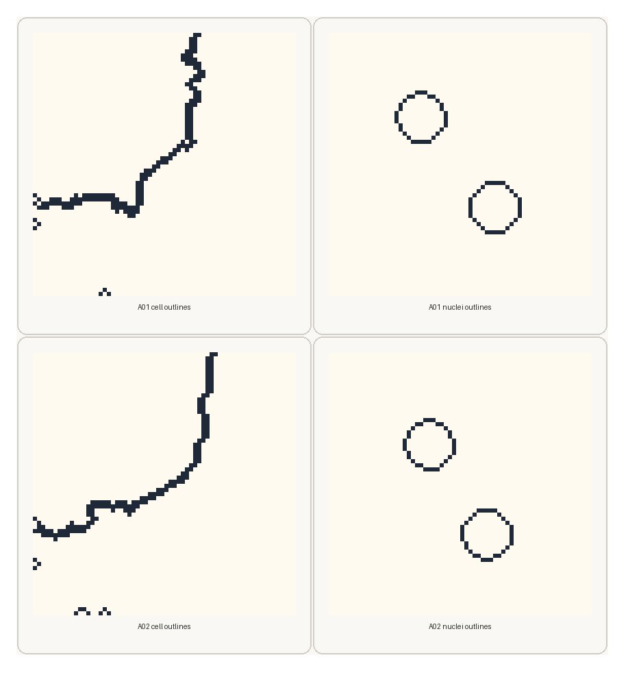
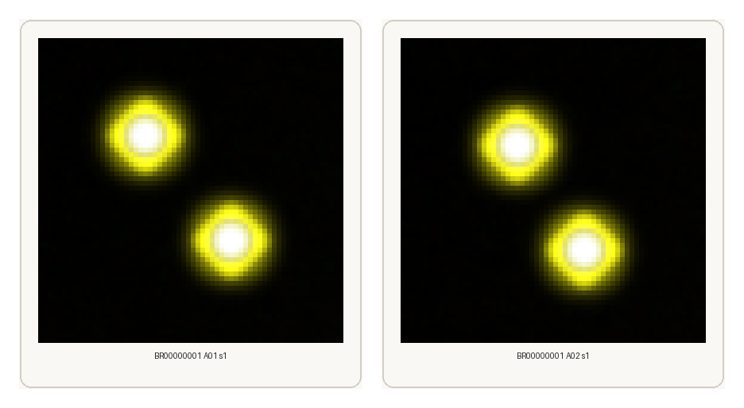

# Segmentation Demo

This page shows one **agent-facing segmentation demo** built from the recorded repository outputs under `demo/workspace/outputs/demo_record_2026_04_25_gpu_final/`.

The goal here is different from [Quick Start](../quick_start/index.ipynb). Quick Start explains the direct classical profiling path. This page shows how an agent-facing request can be resolved into **three concrete segmentation skills**:

- `cp-prepare-segmentation-inputs`
- `cp-extract-segmentation-artifacts`
- `cp-generate-segmentation-previews`

The demo uses real recorded outputs and real result images from the repository. The trace block below is a **documented trace example** written from those recorded outputs. It is not presented as a verbatim saved OpenClaw session transcript.

## Demo Request

The user-facing request for this demo is:

```text
Prepare the segmentation inputs for configs/project_config.demo.json, run the segmentation pipeline, and generate preview PNGs for quick inspection.
```

## Config Used

The agent request above names one config file:

```text
configs/project_config.demo.json
```

In this project, that config is the runtime description for the skills. It tells the skills where the demo backends live, where the workspace lives, which segmentation template to use, and where outputs should be written by default.

The fields that matter most for this demo are:

| Config field | Value in the demo config | Meaning in this demo |
| --- | --- | --- |
| `profiling_backend_root` | `../demo/backend/profiling_backend` | location of the demo raw Cell Painting inputs |
| `segmentation_backend_root` | `../demo/backend/segmentation_backend` | location of the demo segmentation backend assets |
| `workspace_root` | `../demo/workspace` | workspace root for generated intermediate files |
| `default_output_root` | `../demo/workspace/outputs` | default output root if the user does not provide another output path |
| `cellprofiler.segmentation_template` | `segmentation-base` | bundled segmentation `.cppipe` template selected for this run |
| `mask_export_runtime` | `num_shards=1`, `max_workers=1`, `threads_per_worker=1` | runtime settings used for the segmentation export step |

For this page, the important point is simple: **the agent does not guess these backend paths or templates**. It reads them from the project config and then routes the request to the right skills.

## Archived Trace Example

The block below follows the same basic style as the A2 case-trace reference: user request first, then planner steps, tool calls, and observed results.

```text
# Archived CellPainting-Claw segmentation trace example
# Recorded output root:
# - demo/workspace/outputs/demo_record_2026_04_25_gpu_final
# Config:
# - configs/project_config.demo.json

user_input:
Prepare the segmentation inputs for configs/project_config.demo.json,
run the segmentation pipeline, and generate preview PNGs for quick
inspection.

planner_step_1:
intent:
Resolve the segmentation-ready input table before any CellProfiler run.
tool_calls:
- cp-prepare-segmentation-inputs(config="configs/project_config.demo.json")
observed_result:
- load_data_for_segmentation.csv written
- field_count = 2
- wells = A01, A02
- site_count = 2

planner_step_2:
intent:
Run the segmentation pipeline on the prepared fields and collect the
main segmentation artifacts.
tool_calls:
- cp-extract-segmentation-artifacts(config="configs/project_config.demo.json")
observed_result:
- derived pipeline written: CPJUMP1_analysis_mask_export.cppipe
- measurement tables written: Image.csv, Cells.csv, Nuclei.csv
- labels directory written
- outlines directory written
- segmentation_summary.json written
- returncode = 0

planner_step_3:
intent:
Render lightweight preview images for fast visual review of the same
segmentation source fields.
tool_calls:
- cp-generate-segmentation-previews(
    config="configs/project_config.demo.json",
    workflow_root="demo/workspace/outputs/demo_record_2026_04_25_gpu_final/01_segmentation"
  )
observed_result:
- sample_previews_png/ written
- generated_count = 2
- skipped_existing = 0

final_answer_snapshot:
Prepared segmentation inputs for 2 recorded fields, ran the mask-export
segmentation pipeline successfully, and generated 2 preview PNGs for
visual inspection.
```

## Step 1

### `cp-prepare-segmentation-inputs`

This skill writes the `load_data_for_segmentation.csv` file that CellProfiler will read in the next step.

For the recorded demo run, that table contains **two fields**:

| Plate | Well | Site | Purpose |
| --- | --- | --- | --- |
| `BR00000001` | `A01` | `1` | first recorded segmentation field |
| `BR00000001` | `A02` | `1` | second recorded segmentation field |

The full table also includes all channel filenames and illumination references needed by the segmentation backend.

Files written in this step:

- `load_data_for_segmentation.csv`
- `pipeline_skill_manifest.json`

## Step 2

### `cp-extract-segmentation-artifacts`

This skill takes the prepared load-data table, resolves the selected segmentation `.cppipe`, runs the segmentation backend, and writes the main artifact set.

For the recorded demo run, the main outputs were:

- `CPJUMP1_analysis_mask_export.cppipe`
- `cellprofiler_masks/Image.csv`
- `cellprofiler_masks/Cells.csv`
- `cellprofiler_masks/Nuclei.csv`
- `cellprofiler_masks/labels/`
- `cellprofiler_masks/outlines/`
- `segmentation_summary.json`

The recorded manifest shows:

- `field_count = 2`
- `module_count = 37`
- `selected_via = template`
- `execution_mode = derive-mask-export`
- `returncode = 0`

Recorded outline outputs from the demo run:



These panels are not synthetic examples. They are enlarged views of the real recorded outline PNGs for wells `A01` and `A02`.

## Step 3

### `cp-generate-segmentation-previews`

This skill uses the same segmentation source fields and writes lightweight preview PNGs for quick visual review.

For the recorded demo run, the manifest shows:

- `generated_count = 2`
- `field_count = 2`
- `skipped_existing = 0`

Files written in this step:

- `sample_previews_png/`
- `pipeline_skill_manifest.json`

Recorded preview outputs from the demo run:



These preview PNGs are the fast visual check layer. They let the user or agent confirm that the expected fields were processed before moving on to crop export or deeper downstream work.

## Skill Relationship

For this segmentation demo, the three skills play different roles:

| Skill | Main input | Main result | Role in the agent trace |
| --- | --- | --- | --- |
| `cp-prepare-segmentation-inputs` | config plus field metadata | `load_data_for_segmentation.csv` | prepares the run description |
| `cp-extract-segmentation-artifacts` | prepared inputs plus selected `.cppipe` | masks, labels, outlines, and tables | executes the segmentation branch |
| `cp-generate-segmentation-previews` | segmentation workflow root | preview PNGs | gives the first visual review layer |

This is why the agent trace is useful: it makes clear that the agent is **not running an opaque monolithic workflow**. It is resolving the request into a sequence of smaller documented skills with concrete outputs at each step.

## Related Pages

- [OpenClaw](index.md)
- [cp-prepare-segmentation-inputs](../skills/cp_prepare_segmentation_inputs.md)
- [cp-extract-segmentation-artifacts](../skills/cp_extract_segmentation_artifacts.md)
- [cp-generate-segmentation-previews](../skills/cp_generate_segmentation_previews.md)
