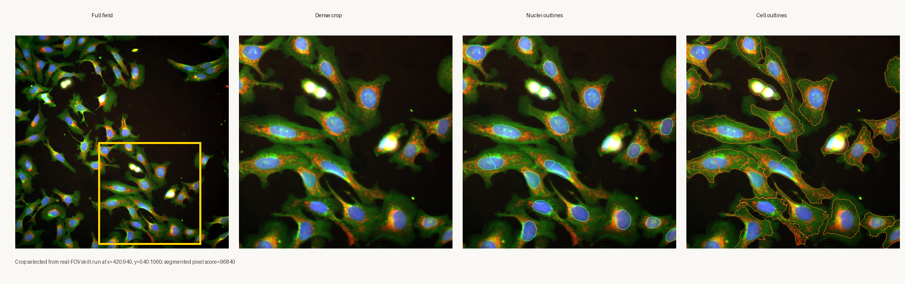

# `cp-extract-segmentation-artifacts`

`cp-extract-segmentation-artifacts` is the segmentation execution step.

It takes the prepared field list, resolves the segmentation `.cppipe`, runs the CellProfiler-based segmentation backend, and writes the artifact bundle that downstream tools can reuse.

## Purpose

Use this skill when you want:

- segmented nuclei
- segmented whole cells
- quick review images to inspect whether the boundaries look reasonable
- reusable object definitions for later crop and feature-extraction steps

## Main Outcome

After this skill finishes, the image is no longer just raw pixels. The run has identified nuclei and whole cells as distinct objects that downstream steps can reuse.

In practice, this is the step that gives you:

- segmented nuclei
- segmented whole cells
- quick review images to check whether the boundaries look reasonable
- cell-level results that later crop and feature-extraction steps can build on

## Inputs

This skill reads:

- a project config such as `configs/project_config.demo.json`
- the segmentation input table written by [cp-prepare-segmentation-inputs](cp_prepare_segmentation_inputs.md), or default segmentation inputs resolved from the config
- the segmentation `.cppipe` template or override selected by the config
- the raw Cell Painting images and illumination-correction files from the project config
- an optional output directory

In the demo setup, the config selects the bundled segmentation template and derives a mask-export-ready `.cppipe` at runtime.

## Outputs

The main user-facing results are:

- nuclei segmentation
- whole-cell segmentation
- review-ready outline images
- cell-level segmentation tables for downstream analysis

## Agent Demo

This page is based on a real local OpenClaw run recorded against the completed segmentation result for one real Cell Painting image:

- turn timestamp: `2026-05-02 18:18 GMT+8`
- model: `vibe/gpt-5-mini`

### Request

```text
I already generated a segmentation result for one real Cell Painting image. Please check whether the nuclei and cell boundaries look biologically reasonable before I use it downstream.
```

## Structured Trace

```text
user_input:
I already generated a segmentation result for one real Cell Painting image. Please check whether the nuclei and cell boundaries look biologically reasonable before I use it downstream.

planner_step_1:
intent:
Recover the documented Cell Painting routing guidance before inspecting any files.
tool_calls:
- read("integrations/openclaw/autodl/workspace/skills/cellpaint-pipeline/SKILL.md")
observed_result:
- the workspace skill file loaded successfully
- routing guidance pointed to the segmentation artifact skill for masks, labels, outlines, and segmentation review outputs

planner_step_2:
intent:
Locate the existing image outputs that could support a real segmentation QC pass.
tool_calls:
- exec("find /root/pipeline/CellPainting-Claw -type f \\( -iname '*.png' -o -iname '*.jpg' -o -iname '*.jpeg' -o -iname '*.tif' -o -iname '*.tiff' \\) | head -200")
observed_result:
- the repository already contained a completed real-image segmentation result under `demo/real_fov_workspace/outputs/real_fov_segmentation`
- the repository also contained the documentation overview figure at `docs/_static/agent_demo_segmentation/real_fov_segmentation_overview.png`

planner_step_3:
intent:
Open the existing outline images and the overview figure directly for visual inspection.
tool_calls:
- read("demo/real_fov_workspace/outputs/real_fov_segmentation/cellprofiler_masks/outlines/BR00117035_A01_s1--nuclei_outlines.png")
- read("demo/real_fov_workspace/outputs/real_fov_segmentation/cellprofiler_masks/outlines/BR00117035_A01_s1--cell_outlines.png")
- read("docs/_static/agent_demo_segmentation/real_fov_segmentation_overview.png")
observed_result:
- the nuclei outline image loaded successfully
- the cell outline image loaded successfully
- the representative overview figure loaded successfully

planner_step_4:
intent:
Turn the visual inspection into a downstream-use judgment for a human user.
tool_calls:
- no additional tool call
observed_result:
- nuclei appeared as compact discrete objects rather than large merged blobs
- cell boundaries generally expanded around nuclei into plausible whole-cell regions
- the result looked usable for exploratory downstream work, with caution around crowded touching cells

final_answer_snapshot:
The existing segmentation result looked biologically reasonable overall for this real Cell Painting image and seemed usable as a first-pass segmentation before downstream analysis.
```

## Representative Figure

The OpenClaw trace above and the figure below refer to the same completed segmentation result for one real Cell Painting image.



What this figure is meant to show:

- the selected image contains many distinct cells
- nuclei and whole-cell boundaries are different segmentation layers
- this step defines the objects that later crop and feature-extraction steps will reuse

Panels in this figure show:

- `A`
  The full pseudocolor image. The yellow box marks the region chosen for closer inspection.
- `B`
  The selected image crop, shown without segmentation overlays.
- `C`
  The same crop with nucleus boundaries overlaid. This corresponds to the nuclei segmentation written by the skill.
- `D`
  The same crop with whole-cell boundaries overlaid. This corresponds to the cell segmentation written by the skill.

Caption: Representative output from `cp-extract-segmentation-artifacts` on real Cell Painting image `BR00117035 / well A01 / site 1`.

### Observed Result

The agent inspected the existing nuclei and cell boundary outputs directly and judged the segmentation biologically reasonable overall for exploratory downstream use.

## Recorded Reply

```text
[[reply_to_current]] I checked the available real-FOV segmentation outputs and the rendered overview image for the real Cell Painting example.

My biological sanity-check verdict: **usable as a reasonable first-pass segmentation**, with a few caveats to watch before downstream profiling.

What looks reasonable:
- **Nuclei** appear to be detected as compact, discrete objects rather than diffuse blobs.
- **Cell boundaries** generally expand around nuclei in a plausible way instead of collapsing to nuclei-only masks.
- The segmentation does **not** look grossly pathological.

What I'd still be cautious about:
- **Crowded-touching cells** are the first place I'd expect mistakes.
- **Cell outlines are inherently less trustworthy than nuclei** in Cell Painting, especially when cytoplasm boundaries are faint or overlapping.
- One image is enough for a spot check, but not enough to validate a full batch.

Practical recommendation:
- **Okay to proceed for exploratory downstream use**
- **Not yet ideal for final quantitative claims** unless you also confirm one-to-one nucleus-to-cell pairing, few giant merged cells, acceptable edge handling, and plausible object counts across more examples.
```

## Next Skills

- [cp-generate-segmentation-previews](cp_generate_segmentation_previews.md)
- [crop-export-single-cell-crops](crop_export_single_cell_crops.md)
- [dp-export-deep-feature-inputs](dp_export_deep_feature_inputs.md)
